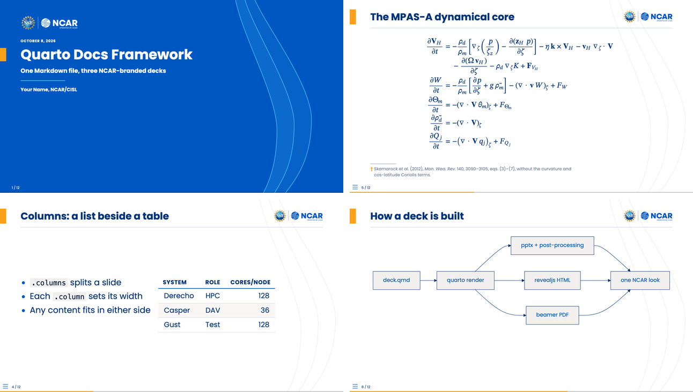
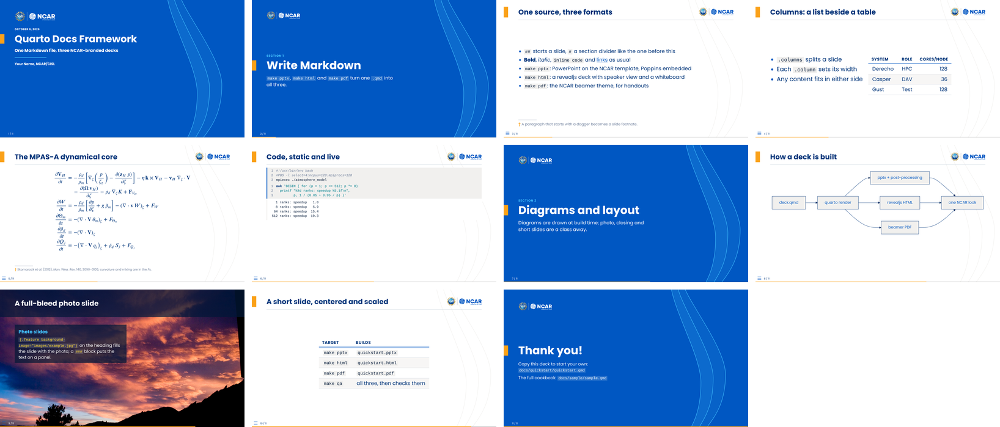
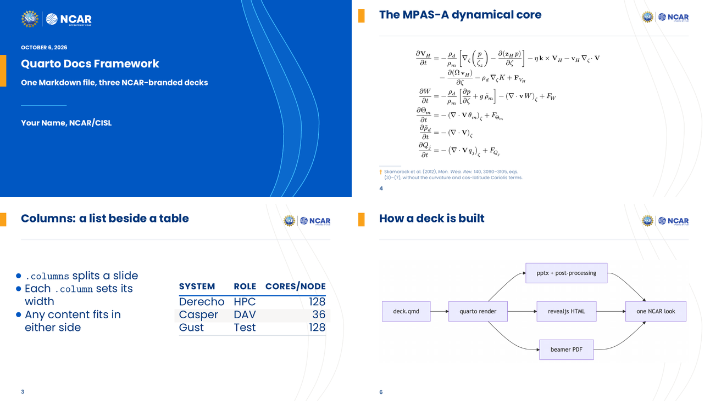

# quarto-docs-framework

NCAR-branded [Quarto](https://quarto.org) template for HPC-style
documentation decks (`.pptx` / `.html` / `.pdf`). Clone, set up the conda
env, copy the quickstart deck, write Markdown.



Two example decks ship with the framework:

- **`docs/quickstart/`** is eleven slides, one of each headline feature. It is the deck to
  copy when you start your own (see "What you get" below).
- **`docs/sample/`** is a **cookbook** showing one
  example of every capability you're likely to need: text formatting, math,
  tables, two-column layouts, image embeds, syntax-highlighted code,
  auto-captured shell output, mermaid diagrams, speaker notes, and the
  `` shortcode. `docs/sample/old.qmd` is preserved as a
  richer real-world example (database schema / REST API / deployment
  diagrams).

## Quick start

```bash
git clone <this-repo> quarto-docs-framework
cd quarto-docs-framework

# 1. Build the conda env (also installs + registers the bash Jupyter
#    kernel so executable {bash} chunks work).
make conda-env
conda activate ./conda-env

# 2. Render the quickstart deck.
cd docs/quickstart
make pptx              # → quickstart.pptx (NCAR-branded, fonts embedded)
make html              # → quickstart.html (revealjs, NCAR web theme)
make pdf               # → quickstart.pdf  (beamer, NCAR beamer theme; needs TeX)
```

Open `quickstart.pptx` (or `quickstart.html` in a browser), then copy
`quickstart.qmd` into a new deck directory and edit it (see "Adding a new deck"
below). When you need a pattern the quickstart deck lacks, `docs/sample/sample.qmd`
probably has it.

**Behind a restrictive proxy** (some cloud containers): if `quarto install
tinytex` cannot download, a system TeX Live works instead (`apt-get install
texlive-xetex texlive-latex-extra texlive-fonts-extra`). If `quarto install
chrome-headless-shell` cannot download, point Quarto at any Chromium with
`export QUARTO_CHROMIUM=/path/to/chrome`, and `make qa` at it with `CHROME`.

## What you get

Every slide of `docs/quickstart/quickstart.qmd`, in the HTML deck:



| Slide | The Markdown behind it |
|---|---|
| [Section divider](docs/quickstart/screenshots/02-divider.png) | `# Write Markdown`, then a paragraph: the subtitle |
| [Bullets and a footnote](docs/quickstart/screenshots/03-text.png) | a list, then a paragraph starting with `†`; `{.vcenter scale="1.2"}` on the heading |
| [Columns](docs/quickstart/screenshots/04-columns.png) | `:::: {.columns}` with a list in one `.column` and a table in the other |
| [Equations](docs/quickstart/screenshots/05-math.png) | LaTeX between `$$`: OMML in pptx, MathJax in HTML, real TeX in the PDF |
| [Code, static and live](docs/quickstart/screenshots/06-code.png) | a ` ```bash ` block, and a ` ```{bash} ` cell run at render time |
| [Diagram](docs/quickstart/screenshots/07-mermaid.png) | a ` ```{mermaid} ` cell (Graphviz ` ```{dot} ` works the same way) |
| [Photo slide](docs/quickstart/screenshots/08-feature.png) | `{.feature background-image="..."}`, the text in a `###` block |
| [Short slide](docs/quickstart/screenshots/09-short.png) | `{.center scale="1.4"}` on the heading |
| [Closing](docs/quickstart/screenshots/10-closing.png) | `## Thank you! {.closing}` |

The same source as a beamer PDF (`make pdf`):



The pptx is the same deck again, on the NCAR PowerPoint template. To refresh these
images after editing the deck, run `make screenshots` in `docs/quickstart/`; it needs
everything `make qa` does (see "Checking a deck").

## Layout

```
quarto-docs-framework/
├── Makefile               # top-level: `make conda-env`, env mgmt
├── conda-env.yaml         # quarto + jupyter + bash_kernel + helpers
├── docs/
│   ├── Make.common        # shared per-deck recipes (pptx/html/pdf/clean)
│   ├── common/
│   │   ├── _quarto.yml    # shared Quarto config (symlinked into decks)
│   │   ├── _extensions/benkirk/ncar/  # NCAR beamer theme (vendored; symlinked into decks)
│   │   ├── assets/fonts/  # Poppins .fntdata blobs (EOT-subsetted)
│   │   ├── branding/ncar/template.pptx
│   │   └── utils/
│   │       ├── embed_poppins.py    # post-render font embedder
│   │       └── enable_autofit.py   # primes "Shrink text on overflow"
│   ├── quickstart/                 # the short exemplar deck: copy this one
│   │   ├── quickstart.qmd
│   │   ├── screenshots.py  (make screenshots: the README images)
│   │   └── screenshots/    (those images, committed)
│   └── sample/                     # the cookbook deck
│       ├── Makefile        (3-line include of ../Make.common)
│       ├── _quarto.yml     (symlink → ../common/_quarto.yml)
│       ├── _extensions     (symlink → ../common/_extensions, made by make)
│       ├── _ncar           (symlink → ../common, made by make)
│       ├── sample.qmd      (the cookbook)
│       ├── old.qmd         (richer real-world example, kept for reference)
│       └── images/         (drop your PNGs / JPGs here)
└── conda-env/              # local conda prefix, gitignored
```

Room to grow: additional brand packages (`docs/common/branding/ucar/`,
`.../cisl/`) or additional shared assets (`docs/common/assets/images/`)
drop in as sibling subdirs without disturbing existing decks.

## Build pipeline

Per deck, `make pptx` runs:

1. `quarto render <deck>.qmd --to pptx -o <deck>.pptx`
   - Uses `reference-doc: _ncar/branding/ncar/template.pptx` from the
     deck's `_quarto.yml`, so the output inherits NCAR theme colors,
     title slide layout, masters, etc.
2. `python3 ../common/utils/section_subtitle.py <deck>.pptx`
   - Merges the paragraph after a `#` section heading back onto the
     Section Header slide as its subtitle. Pandoc otherwise drops it onto
     a separate untitled slide.
   - Then dresses every divider as the HTML and PDF decks draw it: a
     "SECTION n" label, the orange tab, and the label, title and subtitle
     centered as one block. The blue field, logo and waves come from the
     template's Section Header layout (see "Template constraints").
3. `python3 ../common/utils/enable_autofit.py <deck>.pptx`
   - Flips every body placeholder's autofit dropdown from "Do not Autofit"
     to "Shrink text on overflow." See "About text autofit" below.
4. `python3 ../common/utils/embed_poppins.py <deck>.pptx`
   - Re-injects the four Poppins variants as `<p:embeddedFont>` entries.
     Pandoc strips these on reference-doc copy; the script puts them
     back so the font travels with the file.
5. `python3 ../common/utils/style_footnotes.py <deck>.pptx`
   - Restyles body paragraphs that start with `†` or `‡` as footnotes (smaller,
     muted, the marker in accent orange), since pandoc ignores inline size and
     color in markdown. HTML and PDF go further: the theme moves them to the
     slide's foot under a short rule.
6. `python3 ../common/utils/link_captions.py <deck>.pptx`
   - Captions each linked picture (see "Linked images" below) with its URL,
     bottom center, muted; the caption box is itself the link.
7. `python3 ../common/utils/slide_layout.py <deck>.pptx`
   - Applies a slide's layout controls (see "Centering and scaling a short
     slide" below), which `common/slide-layout.lua` leaves as a speaker-notes
     line because pandoc drops slide classes; the line is removed.
8. `python3 ../common/utils/style_tables.py <deck>.pptx`
   - Styles every table as the HTML theme does: a bold capitalized header
     over an NCAR Blue rule, thin rules between rows, every second row light
     gray. Pandoc always writes PowerPoint's "Medium Style 2", so the look is
     set cell by cell. Evenly split columns are re-split by content. The PDF
     gets the same look from the beamer theme itself, apart from the rules
     between rows.

`make html` (revealjs) and `make pdf` (beamer) bypass steps 2 through 8 — the
template, fonts, autofit, and the other pptx fix-ups are pptx-specific.

### Linked images

Wrap an image in a link and the picture opens that page, in every format:

```markdown
[{height="72%" fig-align="center"}](https://example.org/dashboard)
```

Each format also shows the URL, small and muted, so a reader knows the
picture is live: the slide footer in HTML, a line at the foot of the PDF page
(`common/linked-images.lua`), and a caption box in pptx (`link_captions.py`;
pandoc can't add one without splitting the slide). One line per slide, from
its first linked image. `{height="72%"}` is the full-width screenshot recipe
and fits all three.

### Centering and scaling a short slide

Five per-slide controls on the heading, each independent, act on the body
(everything but the title, speaker notes and footnotes). They come from the
vendored theme (>= 2.5.0); pptx gets them through step 7.

```markdown
## Who's still on legacy {.center scale="1.4"}
## A short script {.hcenter .fill}
```

| Control | HTML | PDF | pptx |
|---|---|---|---|
| `.hcenter`: center the body across as a block | yes | prose, lists, plain code (a table centers anyway) | no |
| `.vcenter`: center it between the title and the floor | yes | yes | text yes; a table to an estimated center |
| `.center`: both (the theme's, not Quarto's) | yes | yes | as `.vcenter` |
| `scale="S"`: text, tables and code × S | yes (autofit still shrinks an overshoot) | yes (no autofit: check the page) | yes |
| `.fill`: grow until it just fits, up to 3× | yes | no; add `scale=` | no; add `scale=` |

### PDF (beamer)

`make pdf` renders with `--to ncar-beamer`. That format comes from the NSF NCAR
beamer theme ([benkirk/NCAR_beamer_template](https://github.com/benkirk/NCAR_beamer_template)),
which is vendored in `docs/common/_extensions/benkirk/ncar/`. Make symlinks
`_extensions` into each deck directory, just as it does for `_quarto.yml`.

- **You need Quarto 1.6 or newer** (the conda env pins it): the theme's Lua
  filter uses a pandoc macro that older Quarto releases lack.
- **You need TeX with XeLaTeX.** Quarto's own TinyTeX (`quarto install
  tinytex`) works and installs missing LaTeX packages on the fly. So does a
  system TeX Live. (Plain-LaTeX decks, not Quarto ones, can also be written
  on Overleaf: the theme README's
  [Overleaf section](https://github.com/benkirk/NCAR_beamer_template#overleaf)
  has a one-click link.)
- **No fonts to install.** The theme bundles Poppins and the official logo
  lockups.
- **Theme options** go in a deck's front matter:
  `themeoptions: [brand=ucar, title=light, fonts=bundled]`. A deck-level
  list replaces the shared one, so keep `fonts=bundled` (from the shared
  `_quarto.yml`): it pins the theme's own Poppins and never probes for a
  system copy.
  - `titlegraphic: images/photo.jpg` puts a photo on the title slide.
  - `fineprint: "..."` adds small print under the title block.
  - `mathfont=stix` (or `lm`, `pagella`, `sans`, `fira`, `poppins`, any
    OpenType math font) changes the math font; the default is New Computer
    Modern Math, scaled to sit with Poppins. Quarto's own `mathfont:` key
    still works. The theme README shows every preset on one slide.
  - `waves=false` removes the faint brand wave lines behind content slides
    (they are on the pptx master too).
- **Markdown extras:**
  - `## Title {.feature background-image="images/photo.jpg"}` makes a
    full-bleed photo slide (`background=` also works; `background-image=`
    doubles as the revealjs background).
  - `## Thank you! {.closing}` makes a closing slide.
  - `### Heading {.example}` / `{.alert}` give block variants.
  - `[text]{.alert}` emphasizes text.
- **Beamer never shrinks overflowing text.** The shared config uses 10pt,
  which matches the pptx template's text density. Add `{.shrink}` to a dense
  slide's heading to scale that one slide down; pptx ignores the class.
- **To update the theme:** `cd docs/common && quarto update benkirk/NCAR_beamer_template`.

### HTML (revealjs)

`make html` renders with `--to ncar-revealjs`, the web format from the same
vendored extension. The deck looks like the PDF: title slide with the brand
waves (or `titlegraphic:`), section dividers with subtitles, content slides
with the accent tab and logo, `.feature` and `.closing` slides. The same
`themeoptions:` apply (`brand=`, `title=`, `waves=`; math in the browser is
MathJax's, so `mathfont=` does not). Open `<deck>.html` in a browser
and keep `<deck>_files/` beside it.

- **Presenting:** `s` speaker view (notes), `m` slide menu, `b`/`c`
  whiteboard / draw on the slide, `f` full screen.
- **HTML-only extras:**
  - `## Title {.brand-dark}` puts a content slide on Space with white text;
    pptx and PDF draw an ordinary slide.
  - Overflowing content slides shrink to fit (see "About text autofit").
  - Mermaid and Graphviz draw live in the browser; mermaid uses the brand
    colors and Poppins, not the baked-PNG look of pptx/PDF.
- **One file to share:** in a deck's front matter,
  ```yaml
  format:
    ncar-revealjs:
      embed-resources: true
      chalkboard: false     # the whiteboard can't be embedded
  ```
  gives a single self-contained `.html`.
- **PDF from the browser:** open `<deck>.html?print-pdf` in Chrome and print
  with background graphics. `make pdf` is usually the better handout.

## Checking a deck

`make qa` builds every format, then checks the outputs (`docs/common/utils/deck_qa.py`):

- **Failures:**
  - slide counts that differ between pptx, PDF and HTML;
  - PDF text past the right margin, into the footer, overlapping other text, or running into
    the next table column;
  - HTML content past the right edge;
  - a bare `<word>` in the sources, outside code and backticks: revealjs reads it as a tag
    (reported as `file:line`).
- **Hints:**
  - short slides, with the share of the body they use;
  - `.smaller` without `.fill`;
  - slides the HTML autofit had to shrink.
- **Plain names:** list names that belong in backticks in `qa-names.txt` (one per line) in
  the deck directory, and every plain-text use is reported.

Everything lands in `_qa/` (gitignored): `report.txt`, `usage.tsv`, a contact sheet per
format, and per-slide PNGs. In a directory with several decks, `make qa DECKS=name`
checks one.

The checks need poppler, Pillow and Playwright, which are all in `conda-env.yaml`.
`make conda-env` installs Playwright's headless Chromium; set `CHROME` to use another
build. Without Playwright the HTML checks are skipped and the rest still run. For Claude
Code, the `deck-polish` skill (`.claude/skills/`) covers what to do with the findings.

## Publishing the HTML decks

`make site` gathers the HTML decks of a directory into `_site/` (gitignored), a static
site that works as is: `python3 -m http.server -d _site`. Every deck's `<deck>_files/libs/`
is a subset of one union, so the site keeps a single `libs/` and rewrites the references
(a 13-deck directory goes from ~140 MB to ~16 MB); `images/` ships beside the decks, and
`index.html` lists them by their front matter, first deck first.

`make publish` pushes `_site/` to a GitHub Pages branch. The branch is a build artifact,
not a record: each publish replaces it with **one** parentless commit, so nothing
accumulates however often you publish (Pages serves the branch tip and keeps no versions
of its own). The price is that every publish uploads the whole site, since a commit with
no parent gives git nothing to delta against. Enable Pages once, from the branch:

```bash
gh api -X POST repos/<owner>/<repo>/pages \
  -f build_type=legacy -f 'source[branch]=gh-pages' -f 'source[path]=/'
```

Settings go in the deck Makefile, before the include:

```make
DECKS          := samuel 1-overview 2-concepts
SITE_EXTRA     := companion                # directories of hand-written pages, listed on the index
SITE_NOINDEX   := 1                        # <meta name="robots" content="noindex"> on every page
PUBLISH_PREFIX := presentations/samuel     # path under the Pages root (default: the root)
PUBLISH_BRANCH := gh-pages                 # default
PUBLISH_REMOTE := origin                   # default
include ../framework/docs/Make.common
```

Two things to know: branch-based Pages is soft-limited to 10 builds an hour, and each push
shows in the repo's Actions tab as GitHub's own `pages-build-deployment` run. A public repo
publishes to a public URL; `SITE_NOINDEX` keeps it out of search engines, nothing more.

## Adding a new deck

```bash
cd docs
mkdir roadmap && cd roadmap

cat > Makefile <<'EOF'
include ../Make.common
EOF

# then author roadmap.qmd. _quarto.yml is auto-symlinked from
# ../common/_quarto.yml on first `make` invocation.
make pptx
```

`Make.common` infers the deck name from `$(notdir $(CURDIR))`, so the
output file is `<dirname>.pptx`. Override with `OUT=foo` if needed.

A directory can hold several decks that share images and fragments, e.g. a
full deck plus one deck per part:

```make
DECKS := roadmap 1-intro 2-details
include ../Make.common
```

Each `<name>.qmd` builds `<name>.pptx` / `.html` / `.pdf`, and `make pptx`
builds all of them. Put shared slide bodies in `_*.qmd` fragments and pull
them in with ``; quarto skips underscore files
when rendering, and make treats every `_*.qmd` and `data/*` in the directory
as a prerequisite of every deck, so editing one rebuilds them all.

A deck that needs custom Quarto config (a different reference template,
extra extensions, etc.) can replace the symlinked `_quarto.yml` with a
real file — `make` sees the file already exists and skips the symlink
recipe.

## Using the framework from another repo

A project can keep its decks in its own tree and take this framework as a git
submodule, pinned to a commit. Its decks then live wherever it likes, and
nothing of the project's goes into this repo.

```bash
git submodule add https://github.com/benkirk/quarto-docs-framework.git docs/presentations/framework
mkdir docs/presentations/roadmap && cd docs/presentations/roadmap
echo 'include ../framework/docs/Make.common' > Makefile
# author roadmap.qmd, then
make -C ../framework conda-env    # once: the framework's own environment
make pptx
```

- **Include `Make.common`, by a path relative to the deck directory.** It finds
  everything else from that path. A symlink to it would not work: the path
  would be the link's own directory.
- **Make links the rest into the deck directory on the first build:**
  `_quarto.yml`, `_extensions` and `_ncar` (this repo's `docs/common/`, which
  the shared `_quarto.yml` reaches its filters and pptx template through). The
  consumer gitignores those three links, and its build outputs.
- **Everything else works as it does here:** `DECKS`, `_*.qmd` fragments,
  `make qa` (with the deck's own `qa-names.txt`), and a deck's own
  `_quarto.yml` in place of the link.
- **Activate the framework's environment to build**, as in Quick start:
  `conda activate <path>/framework/conda-env`. It lives in the submodule and is
  gitignored there.
- **A framework fix goes here first.** Merge it here, then move the
  consumer's pin (`git -C docs/presentations/framework pull`, then commit the
  new pointer). The NCAR beamer theme follows the same path one level down.
- **The deck-polish skill:** a consumer can link
  `.claude/skills/deck-polish` to `docs/presentations/framework/.claude/skills/deck-polish`.

CI checks this layout on every pull request
(`.github/workflows/ci-consumer.yaml`). It checks the framework out at
`consumer/docs/presentations/framework`, writes a hello-world deck beside it,
and builds all three formats from there.

## Executable shell chunks

Quarto can capture the live output of a shell command at render time:

````markdown
```{bash}
#| echo: true
which mpicxx && mpicxx --version
```
````

Both the command and its captured stdout land on the slide. This needs
the Jupyter `bash` kernel, which `make conda-env` installs and registers
into the env (`bash_kernel` pip package + `python -m bash_kernel.install
--sys-prefix`). The deck's frontmatter must opt in:

```yaml
engine: jupyter
jupyter: bash
```

Code runs on the build host, not the viewer's machine — output is baked
into the .pptx.

## About text autofit

Pandoc's PPTX writer emits empty `<a:bodyPr/>` on every placeholder,
which corresponds to PowerPoint's "Do not Autofit" — long text overflows
the placeholder visually. `enable_autofit.py` rewrites these to
`<a:bodyPr><a:normAutofit/></a:bodyPr>`, which sets the dropdown to
"Shrink text on overflow."

Caveat: PowerPoint computes the actual `fontScale` only on edit, not on
load, so the file still opens with overflowing text — but a single click
into any overflowing cell triggers the recompute and the text shrinks
permanently. After saving, subsequent opens render correctly.

A fully automated post-render shrink would need to drive PowerPoint
externally (e.g. a LibreOffice round-trip, AppleScript UI scripting, or
a `.pptm` macro). None of these are wired up — author-side discipline
(split walls of text into multiple slides, use columns) is cheaper and
more robust.

The HTML deck fits itself: a content slide that runs past the bottom margin
shrinks its body text (down to 65%) until it fits, keeping the title size.
`{.smaller}` still sets a slide smaller from the start:

```markdown
## Wall of text {.smaller}
```

PPTX silently ignores `{.smaller}`; revealjs honors it. Opt a slide out of
the HTML autofit with `{.no-autofit}` (or `{.scrollable}`), or a whole deck
with `themeoptions: [autofit=false]`.

## Template constraints

The reference template under `docs/common/branding/ncar/template.pptx`
must stay pandoc-compliant. Two things pandoc is strict about:

- **`slideLayout1` placeholders**: must include all five of `ctrTitle`,
  `subTitle`, `dt`, `ftr`, `sldNum`. Pandoc emits empty `<p:sp/>` stubs
  for any missing placeholder, which PowerPoint then flags as corrupt
  ("Repair?" prompt on open).
- **Layout names**: pandoc looks up layouts by display name. The title
  slide layout must be named exactly `Title Slide`; other layouts pandoc
  knows about are `Title and Content`, `Section Header`, `Two Content`,
  `Comparison`, `Content with Caption`, `Blank`. Missing names don't
  break the build but trigger a `Couldn't find layout named …` warning
  and fall back to pandoc's bundled layout (losing NCAR styling for that
  slide).

- **The Section Header layout is generated** by
  `docs/common/branding/ncar/build_divider_layout.py`: the NCAR Blue field
  (`tx2`), the white logo, and the brand waves (`accent1`), drawn from the
  same curves as the revealjs theme. Rerun it after editing the template in
  PowerPoint, rather than editing that layout by hand. Pandoc keeps only
  template media named `ppt/media/image*`, so the logo is stored under that name.

Verify after any template edit:

```bash
unzip -p docs/common/branding/ncar/template.pptx \
  ppt/slideLayouts/slideLayout1.xml | grep -oE '<p:ph[^/]*/>'
# expect 5 matches
```

## About the font embedding

The theme is wired to Poppins via `<a:fontScheme name="Poppins">`, so
slide masters/layouts all dereference to Poppins through `+mj-lt` /
`+mn-lt`. Embedding the font blobs on top of that is only needed when
the `.pptx` will be opened on a machine without Poppins installed —
without the embed, PowerPoint substitutes (typically Calibri) and the
deck loses its look.

If portability stops mattering, drop the `embed_poppins.py` step from
`docs/Make.common` and delete `docs/common/assets/fonts/` +
`docs/common/utils/embed_poppins.py`.

## License

Copyright © 2026 University Corporation for Atmospheric Research.

This framework is licensed under
[CC BY-SA 4.0](https://creativecommons.org/licenses/by-sa/4.0/) (Creative
Commons Attribution-ShareAlike 4.0 International); the full text is in
[`LICENSE.txt`](LICENSE.txt). You may share and adapt it with attribution,
provided you distribute your changes under the same license.

These parts are **not** covered by that license:

- **NSF, NCAR, UCAR and UCP logos and brand marks.** These appear in
  `docs/common/branding/` and in the vendored theme. They are trademarks
  used under the
  [UCAR brand guidelines](https://ucar.canto.com/v/branding).
- **The Poppins font** (`docs/common/assets/fonts/` and the vendored theme)
  is licensed under the [SIL Open Font License](https://openfontlicense.org).
