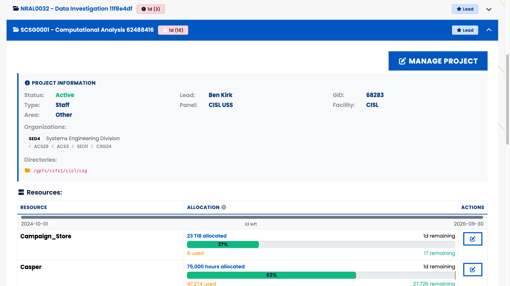
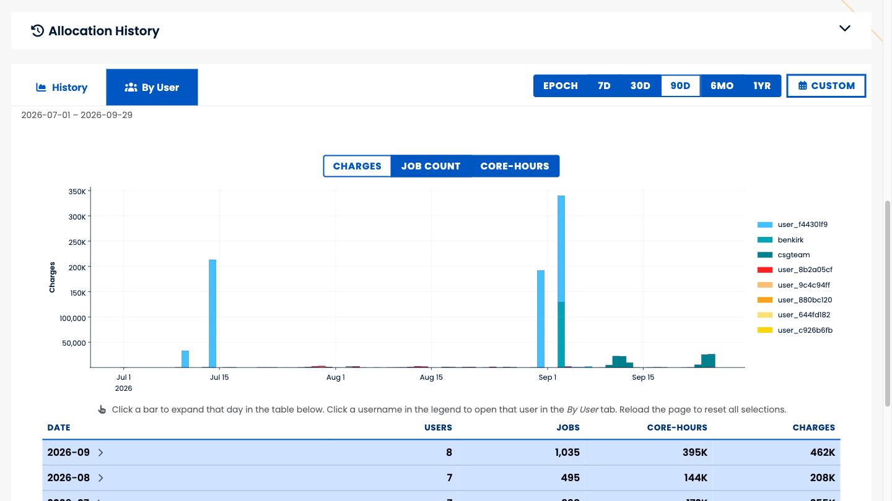
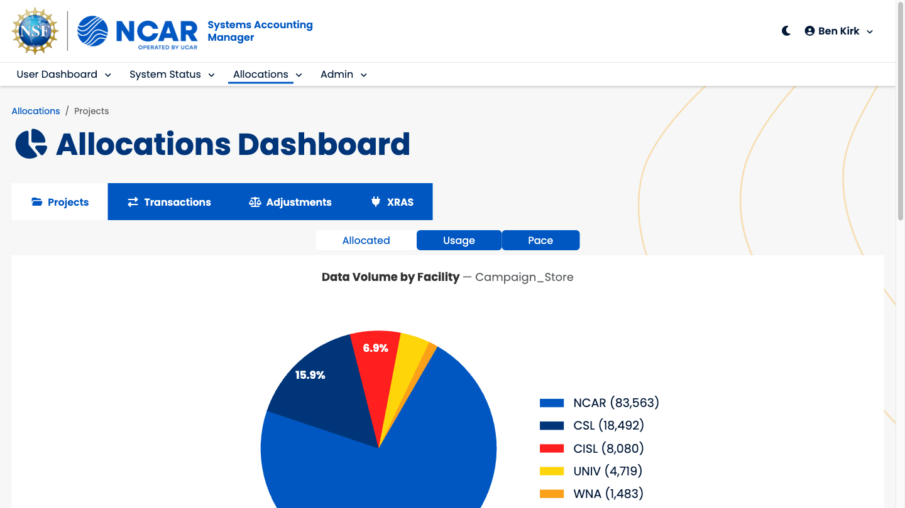
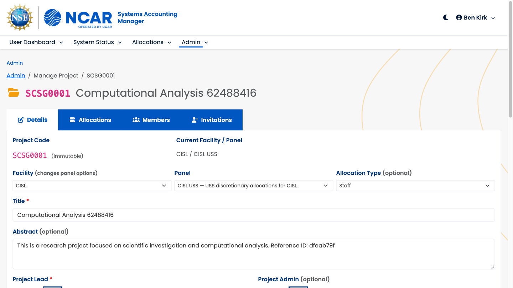
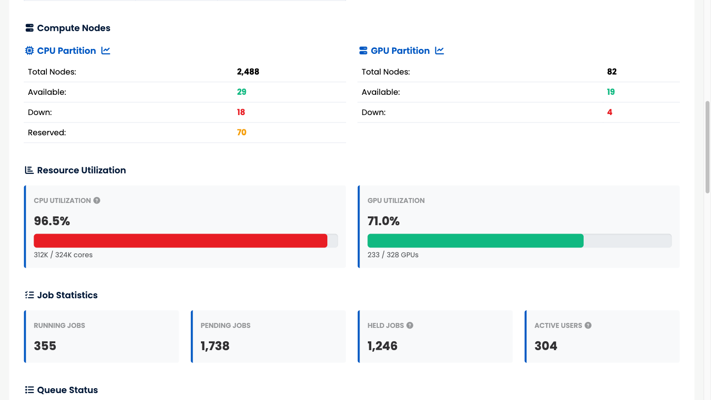
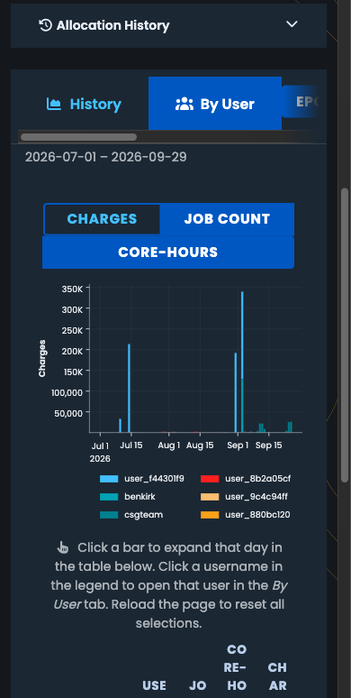
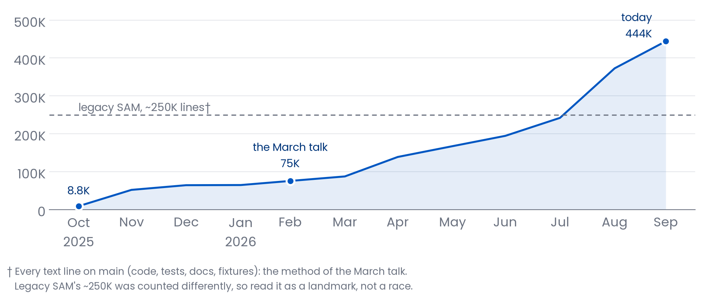

# The Lay of the Land

::: {.content-visible unless-format="beamer"}
What SAM is, who uses it, and what SAMuel puts on top of it.
:::

## SAM in one slide

:::: {.columns}
::: {.column width="58%"}
SAM is the system of record for **who** may compute, **on what**, and **how much**.

- **Projects** hold **allocations** on each resource: an amount, a date window, a balance.
- **Users** belong to projects, and their jobs are **charged** against those allocations.
- University awards arrive through **XRAS**; NCAR, WNA and CSL have their own paths.
- People come from NCAR's identity system. SAM never creates users; it mirrors them.
:::
::: {.column width="42%"}
**Resources it accounts for**

- Derecho and Gust (HPC)
- Casper (analysis and visualization)
- Campaign Store and Stratus (disk)

**Facilities**

- NCAR, UNIV, WNA, CSL, CISL, …
:::
::::

::: {.notes}
The stakeholder one-liner: if you can run a job on Derecho, SAM is why, and SAM is
also how we know how much of your allocation that job used.
:::

## A long and honorable career

SAM has run CISL's allocations for  years:

- A web interface for users and administrators.
- Back-end processing for identity management and accounting.
- A web API feeding the batch scheduler, storage quotas, and friends.
- A MySQL database gluing all of it together.
-  lines of Java (Spring, Hibernate, JSF/PrimeFaces, Flyway), plus a
  plethora of shell scripts and cron jobs.

*† SAMuel is its extended lifecycle, not its obituary. Same database, same data, same people
depending on it.*

## Same database, new everything around it {.smaller}

| | SAM | SAMuel |
|---|---|---|
| Code | Java: Spring, Hibernate | Python: SQLAlchemy 2, Flask |
| Web UI | JSF / PrimeFaces | htmx + Bootstrap 5, mobile and dark mode |
| Database | MySQL | **the same MySQL** (Postgres-ready) |
| Background work | cron + shell scripts | scheduled tasks with a run ledger |
| Deployment | a Tomcat server | containers on CIRRUS (Kubernetes), via GitOps |

## How we got here

- **Oct 2025:** a Python model of the production database, read as-is. *This led to…*
- **Nov–Dec 2025:** a CLI, a REST API, the first dashboards. *This led to…*
- **Early 2026:** allocations dashboard, charging, expiration emails. *This led to…*
- **Apr 2026:** legacy-compatible APIs for the systems that call SAM, and a home on CIRRUS.
  *This led to…*
- **:** XRAS hands its awards to SAMuel directly.
- *…Which leads to today:* SAMuel is production SAM, at ****.

::: {.notes}
The legacy system still owns a few integrations (the LDAP identity mirror, AMIE); both
systems share one database while those move. Part 3 has the details.
:::

## One database, five audiences {.smaller}

| Who | What they do | Where |
|---|---|---|
| Users and PIs | check balances and usage, manage members, invite collaborators | User dashboard |
| CISL staff | run projects and allocations, work the account-request queue | Admin and Allocations dashboards |
| Everyone | see what Derecho, Casper and JupyterHub are doing | Status dashboard (public) |
| Operators | report, audit, fix in bulk | `sam-search`, `sam-admin` |
| Other systems | provisioning, PBS scheduling, XRAS | REST API |

## The big picture

::: {.notes}
Left: what flows in. Right: who reads it back out. SAMuel also pulls XRAS's reports
hourly, which the diagram leaves out to stay legible.
:::

```{mermaid}
%%| fig-width: 10
flowchart TB
    XRAS["ARC / XRAS<br/>allocation awards"]:::inb
    LDAP["NCAR identity<br/>people, groups"]:::inb
    COL["PBS collectors<br/>system status"]:::inb
    JOBS["PBS job history<br/>finished jobs"]:::inb
    SAM[("SAMuel<br/>+ SAM database")]:::core
    WEB["Dashboards<br/>users, PIs, staff"]:::out
    CLI["CLIs<br/>operators"]:::out
    PBS["PBS scheduling<br/>fairshare, queues"]:::out
    PROV["Provisioning<br/>unix groups"]:::out
    MAIL["Email<br/>notices, invites"]:::out
    XRAS -->|awards| SAM
    LDAP -->|identities| SAM
    COL -->|every 5 min| SAM
    JOBS -->|charges, hourly| SAM
    SAM --> WEB
    SAM --> CLI
    SAM --> PBS
    SAM --> PROV
    SAM --> MAIL
    classDef inb fill:#E6F0FA,stroke:#0057C2,color:#00357A
    classDef core fill:#0057C2,stroke:#00357A,color:#FFFFFF
    classDef out fill:#FFF4E0,stroke:#FAA119,color:#00357A
```

## By the numbers

- **** web dashboards: User, Admin, Allocations, Status.
- **** REST API modules. **** answer
  byte-for-byte like legacy SAM, so no caller had to change.
- XRAS's handoff endpoints, served natively.
- **** command-line tools: `sam-search`, `sam-admin`, `sam-status`.
- **** scheduled tasks, checked every .
- **** automated tests, run on every change.

## More than a port

- **Invitations and account requests:** a sponsor invites; the request reaches NUSD as a ticket.
- **Email that remembers:** expiration notices with previews and a ledger, so nobody is mailed
  twice.
- **Live system status** for Derecho, Casper and JupyterHub, every 5 minutes.
- **Usage drill-downs:** per project, per user, per day; export to Excel.
- **Roles and access** managed in the app, scoped by facility.
- **Mobile and dark mode**, because PIs have phones too.

## Plugins: optional by design

Some features live in companion packages, loaded only where they are installed:

- **Job history:** My Jobs, per-job drill-downs, charge ingest (hpc-usage-queries).
- **Disk scans:** who is using which directories (fs-scans).
- **Scheduling tools:** the PBS fairshare tree (hpc-scheduling-tools).

Each has an off switch. A missing plugin shows a banner, never an error page, and the rest
of SAMuel carries on.

::: {.notes}
Registry: src/sam/plugins.py. CLI: BaseCommand.require_plugin. Webapp: PluginExtension
loads each once at startup and logs a warning when one is missing. Kill switches:
JOB_HISTORY_MACHINES, FS_SCANS_ENABLED, HPC_SCHEDULING_TOOLS_ENABLED.
:::

## A PI's view: where did my hours go?

::: {.notes}
The User dashboard: every project a person belongs to, each allocation's balance, and the
date window it runs in. Screenshots use the obfuscated test database.
:::

{height="72%" fig-align="center"}

## Usage, by day and by user

::: {.notes}
Resource Usage Details: charges over time, stacked by user; click a bar to open that day.
:::

{height="72%" fig-align="center"}

## Allocations across every facility

::: {.notes}
The Allocations dashboard: totals by facility and allocation type, per resource, with an
Excel export.
:::

{height="72%" fig-align="center"}

## Admin: one project, every knob

::: {.notes}
The project editor: details, allocations, members and invitations in one place.
:::

{height="72%" fig-align="center"}

## Status: what Derecho is doing right now

::: {.notes}
Fed every 5 minutes by collectors on the HPC systems. Public, no login needed. (The local
copy's "no updates" banner is hidden in this shot.)
:::

{height="72%" fig-align="center"}

## Also on your phone. In the dark.

:::: {.columns}
::: {.column width="55%"}
Every page works at phone width, and dark mode is a first-class theme, charts included.

Charts are drawn on the server for the layout and theme you asked for, so a phone gets a
phone-sized chart, not a shrunken desktop one.
:::
::: {.column width="45%"}
{height="85%"}
:::
::::

## The Progression, continued

::: {.notes}
Picks up where "Confessions of a Vibe Coder" (March 2026) stopped at ~75K lines. Python
alone is now ;  pull requests merged
since October 2025.
:::

{height="72%" fig-align="center"}

## The Good, the Bad, the Murky {.smaller}

| The Good | The Bad | The Murky |
|---|---|---|
| One database, no migration: people saw a new interface, not a new system. | Legacy SAM still owns a few integrations, so two systems share one database for now. | Postgres: both engines work today; an all-Postgres production is a decision, not a task. |
| Every change is tested ( tests) and deployed through GitOps. | A lot of surface for a small team to own. | Much of this was written with an AI agent. What does that mean for the next maintainer? |
| Features ship in days, not release cycles:  merged pull requests. | | |
