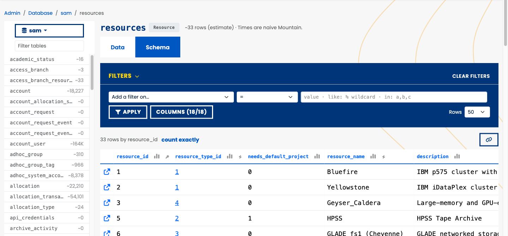

# Where State Lives

Four databases, two engines, one browser.

## Four databases, two engines

::: {.notes}
SAMuel owns two databases and borrows two. It reads and writes sam and system_status; it only
reads job_history and fs_scans, which other pipelines fill. Legacy SAM and the LDAP mirror
still write the sam database directly: same database, two applications.
:::

```{dot}
//| fig-width: 10
digraph DBs {
  graph [rankdir=LR, nodesep=0.3, ranksep=0.8, bgcolor="transparent",
         fontname="Helvetica", fontsize=13, fontcolor="#00357A"];
  node  [shape=box, style="rounded,filled", fontname="Helvetica", fontsize=13,
         fillcolor="#E6F0FA", color="#0057C2", fontcolor="#00357A"];
  edge  [fontname="Helvetica", fontsize=11, color="#6B7280", fontcolor="#6B7280"];

  xras   [label="XRAS"];
  coll   [label="PBS collectors"];
  ldap   [label="LDAP mirror\n+ legacy SAM"];
  jhs    [label="jobhist-sync"];
  scan   [label="disk scanners"];
  samuel [label="SAMuel\nwebapp · CLIs · tasks", fillcolor="#0057C2",
          color="#00357A", fontcolor="#FFFFFF"];

  subgraph cluster_mysql {
    label="MySQL VM (sam-sql)"; style="rounded"; color="#C9D3E0";
    sam [label="sam", shape=cylinder, fillcolor="#FFF4E0", color="#FAA119"];
  }
  subgraph cluster_cnpg {
    label="CNPG csg-postgres (Kubernetes)"; style="rounded"; color="#C9D3E0";
    status [label="system_status", shape=cylinder, fillcolor="#FFF4E0", color="#FAA119"];
    jobs   [label="derecho_jobs\ncasper_jobs", shape=cylinder];
    fs     [label="campaign\ndestor", shape=cylinder];
  }

  xras -> samuel [label="handoffs"];
  coll -> samuel [label="status API"];
  jhs  -> samuel [label="charges"];
  samuel -> sam    [dir=both, label="read-write"];
  samuel -> status [dir=both, label="read-write"];
  samuel -> jobs   [dir=back, style=dashed, label="read-only"];
  samuel -> fs     [dir=back, style=dashed, label="read-only"];
  ldap -> sam  [label="identities"];
  jhs  -> jobs [label="finished jobs"];
  scan -> fs   [label="file metadata"];
}
```

## Who owns what {.smaller}

::: {.notes}
Every engine the webapp holds comes from one enumeration,
src/webapp/utils/engine_inventory.py (engine_sources()): the Admin Configuration card, the
db-pool health endpoint and the /database browser all read it. A new plugin database shows
up on all three by registering itself. Owning code: src/sam/ (sam), src/system_status/ with
Alembic (system_status), and the hpc-usage-queries plugins job_history (derecho_jobs,
casper_jobs) and fs_scans (campaign, destor). Prod MySQL is sam-sql.ucar.edu.
:::

| Database | Prod engine | Written by | Read by |
|---|---|---|---|
| sam | MySQL VM | SAMuel, legacy SAM, LDAP mirror | everything |
| system_status | CNPG, read-write | collectors, task ledger, logins | status pages, admin |
| job_history | CNPG, read-only | jobhist-sync | My Jobs, charge rebuilds |
| fs_scans | CNPG, read-only | disk scanners | disk-scan tabs |

## SAM: the core in one picture

::: {.notes}
Generated from the ORM metadata by sam-queries' scripts/er_diagram.py, so it cannot drift from
the models. A project has one account per resource; allocations hang off the account;
account_user rows say who may charge it. project and allocation each point at themselves: both
are trees.
:::



## remaining = allocated − used

::: {.notes}
Every term is a table. used = charges + adjustments. allocated is allocation.amount over [start_date, end_date]; charges come
from one pre-aggregated daily summary table; adjustments are manual credits and debits. The
dashboards, the API (AllocationWithUsageSchema), sam-search and fstree all compute it the same
way. The invisible layout edges only stack the summaries in two rows.
:::



## One resource, one summary table

- Five daily summary tables: `comp`, `dav`, `hpc`, `disk`, `archive`.
- A resource's charges live in **exactly one** of them, named by its `activity_type`.
- Summed over the allocation's window, `activity_date` inclusive at both ends; an open-ended
  allocation runs to now.
- Disk is the exception: "used" is the latest snapshot's TiB, not a sum.

† The sum used to follow `resource_type`, adding comp + dav. Casper's 2019–2022 history is
mirrored in both tables. Guess what that did to its totals.

::: {.notes}
src/sam/accounting/calculator.py, ACTIVITY_TYPE_TO_CHARGE_KEY. hpc_charge_summary carries the
legacy HPC machines, so a resource_type-based sum also missed them. Fixed in sam-queries #570.
:::

## Allocations are trees

- `project.parent_id` plus nested-set coordinates (`tree_left` / `tree_right`) make a subtree
  query one `BETWEEN`.
- `allocation.parent_allocation_id`: a child **inherits** its root's pool, and a parent's usage
  is its whole subtree's, on every surface.
- Two conventions, stored identically: a **shared pool** (every member carries the whole pool)
  and a **subdivided award** (children carve their amounts out of the root's).

## A subdivided award, as PBS sees it

::: {.notes}
CESM0002 on Derecho, from the sam_and_pbs deck's fairshare tree: blue interior nodes hold
subtree totals, yellow self-leaves hold what a root kept for itself. That deck tells the whole
SAM-to-PBS story.
:::



## is_active: one question, every model

:::: {.columns}
::: {.column width="45%"}
One hybrid property, three uses:

- SQL: `q.filter(Project.is_active)`
- Python: `if allocation.is_active:`
- Inverted: `q.filter(~User.is_active)`
:::
::: {.column width="55%"}
- **Project, Facility, …** (`ActiveFlagMixin`): `active` is true
- **Account, …** (`SoftDeleteMixin`): not `deleted`
- **AccountUser, …** (`DateRangeMixin`): today is inside start/end
- **User:** active **and** not locked
:::
::::

::: {.notes}
A SQLAlchemy hybrid property, so the same name works in Python and in a filter(). About 38 ORM
classes answer it: 29 through one of the three mixins in src/sam/base.py, 9 with their own
(Machine and Resource mean commissioned; Queue and PanelSession, a date window). The rule in
CLAUDE.md: never compare raw columns.
:::

## How many tables? Depends who you ask

:::: {.columns}
::: {.column width="50%"}
**The database says** (obfuscated test copy)

-  tables +  views
-  of them unmapped: Flyway's bookkeeping and legacy scratch
  tables
:::
::: {.column width="50%"}
**The models say**

-  tables +  views
- and nothing modeled that the database lacks

† Our own docs said ~100, 97 and ~107. Now a script counts, and the deck quotes it.
:::
::::

::: {.notes}
docs/samuel/count_tables.py: information_schema on the obfuscated test DB (host port 3307 only;
the script refuses anything else) against the ORM metadata. The /database browser agrees: "121
tables and views". system_status adds  more.
:::

## MySQL today, Postgres tomorrow

- **Prod:** MySQL on the VM, shared with legacy SAM. **samuel-dev:** Postgres on CNPG.
- **One switch:** `SAM_DB_DRIVER=mysql|postgresql`; the same code, tests and CI run on both.
- **Horizon 1 done** (#549–551, 2026-09-12): the 7 views ported, a loader, the dual-backend CI.
  Expected failures went from 416 to 0 in one day.
- **Still open:** retire the Java SAM, bring the sam schema under Alembic, flip prod.

::: {.notes}
Source: docs/plans/implemented/POSTGRES_MIGRATION.md. The dialect differences Core cannot
express live in sam.sqlcompat: the row constructor, the schema predicate, the statement-time
clock, and a case-insensitive LIKE (34 .ilike() sites). The loader recreates MySQL's _ci
behavior with an ICU collation on 121 columns. Prod cannot flip while legacy SAM shares the
database.
:::

## Fourteen ways the engines disagree {.smaller}

:::: {.columns}
::: {.column width="50%"}
1. TIMESTAMP + CURRENT_TIMESTAMP
2. Backticks in the nested-set SQL
3. `TIMESTAMP(3)` means timezone 3
4. `Float(precision)`
5. GROUP BY strictness, `VALUES ROW()`
6. Case sensitivity (collation)
7. Boolean storage
:::
::: {.column width="50%"}
8. `'0000-00-00'` sentinel dates
9. `String(16384)`
10. Boolean + `server_default=text('0')`
11. Index names are schema-global
12. `varchar(n)` is enforced
13. The test suite's own MySQL-isms
14. `now()` differs in zone, type and timing
:::
::::

::: {.notes}
Each has a write-up with the fix in POSTGRES_MIGRATION.md. Number 14 is still the most common
CI flake: Postgres' now() is the transaction start, so two "nows" in one test are equal.
:::

## system_status: the pulse

:::: {.columns}
::: {.column width="50%"}
 tables, SAMuel's own:

- **snapshots** every 5 min: Derecho, Casper, queues, filesystems, login nodes, JupyterHub
- **lookups:** systems, queues, filesystems, users, projects
- **outages** and reservations
- the **task ledger** and **user last-seen**
:::
::: {.column width="50%"}
- The one database under **Alembic**: 7 revisions, `0001_baseline` to `0007_user_last_seen`.
- Postgres in prod, MySQL in compose, SQLite in the tests: one set of models.
- Collectors never touch it directly: they POST to `/api/v1/status/`.
:::
::::

::: {.notes}
src/system_status/models/; migrations/system_status/versions/. user_last_seen was backfilled
in prod back to 2011. SAM's own schema stays unmanaged by Alembic while legacy SAM shares it.
:::

## PSA - Don't let this happen to you…

- **2026-09-13, 03:24 UTC:** a CPU-limit change made CNPG recreate both Postgres pods; the
  primary restarted in place.
- `/ready` required **every** database, so the `system_status` ping failed, on every replica,
  at once. The Service had no endpoints: **~3.5 minutes down**, with MySQL fine throughout.
- **Fixes:** `/ready` gates on `sam` alone (a secondary answers 200 "degraded"); connect
  timeouts and keepalives on every engine; CNPG switches over instead of restarting (<1 s).

† The rule now lives in CLAUDE.md: never add a secondary database to `/ready`.

::: {.notes}
docs/plans/implemented/CNPG_ROLL_RESILIENCE.md. The trigger was an unrelated change in
hpc-usage-queries (#113); the fixes were SAM #556 and hpc-usage-queries #114. The lesson
generalizes: a readiness check that depends on a shared external service fails every pod at
the same moment, and turns a blip into an outage.
:::

## Borrowed databases, read-only {.smaller}

::: {.notes}
Both come from the hpc-usage-queries plugin, reach the CNPG read-only service, and connect as a
read-only role; separate writer roles fill them. The application_name tag and statement
timeout are set in a connect listener (src/webapp/plugins/base.py), so a slow query on the
Postgres side names its pod and plugin: sam-webapp:<pod>:job_history:<machine> and
sam-webapp:<pod>:fs_scans:<db>:<collection>.
:::

| | job_history | fs_scans |
|---|---|---|
| Databases | `derecho_jobs`, `casper_jobs` | `campaign`, `destor` |
| Engines | one per machine | one per database × schema |
| Timeout | 60 s | 100 s |
| Pool | 5 + 10 overflow | owned by the plugin |
| Off switch | `JOB_HISTORY_MACHINES=` | `FS_SCANS_ENABLED=0` |

## /database: every engine, read-only

::: {.notes}
Replaced Flask-Admin (#620, #622, 2026-09-25). Tables are found by reflection, so a new table
needs no code. Every query runs in a READ ONLY transaction with a 5 s statement timeout; row
counts are catalog estimates (a button counts exactly); secret-shaped columns are redacted and
never selected. Gated by ADMIN_DATABASE, kill switch DB_BROWSER_ENABLED. Yes, the first rows of
the resources table are Bluefire and Yellowstone.
:::

[{width="78%" fig-align="center"}](https://sam.hpc.ucar.edu/database/sam/resources)

## TL;DR - where state lives

- **Two owned** (`sam`, `system_status`), **two borrowed** (job_history, fs_scans).
- SAM's schema belongs to the database, and legacy SAM still shares it.
- Every balance is one equation over one summary table per resource.
- `is_active` is the one way to ask "is this live?".
- Secondary databases can degrade SAMuel; they must never take it down.
